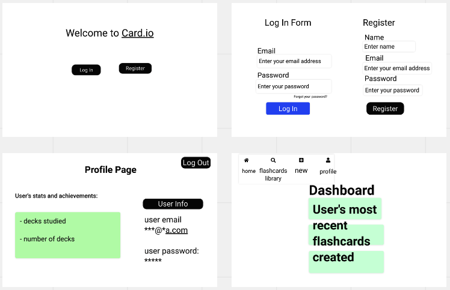
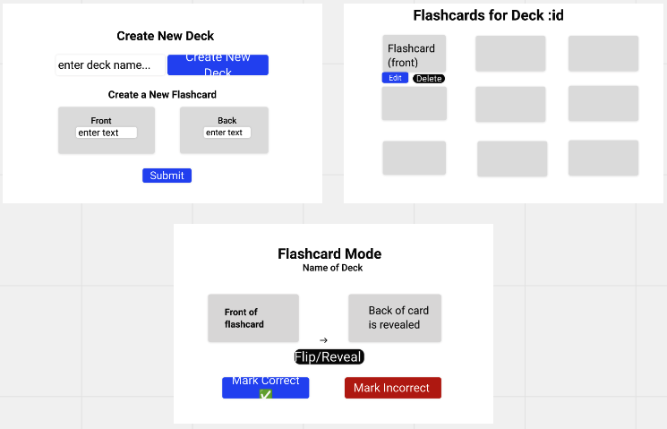

# CARD.IO Web App

A full-stack MERN application that enables users to create and manage digital flashcards to improve their learning experience. The application incorporates users authentication, image handling via Cloudinary API, and a responsive design for a seamless experienece across various devices.

## Description

The Card.io Web App provides an intuitive platform for users to create, edit, delete, and study flashcards on a range of topics. Through an easy-to-use interface, users can register, log in, and manage their flashcards efficiently. The application also offers the ability to study flashcards in a dedicated study mode, enhancing the overall learning experience.

## Technologies

+ We plan to utilize the Cloudinary API to handle uploading, storing, and retrieving images for user profiles and flashcards.
+ Styling will be completed with React-Bootstrap package.

## ERDs

## Card.io Web App API Routes

| Description                         | HTTP Method | Path                   | CRUD Action  | View Page            |
|-------------------------------------|-------------|------------------------|--------------|----------------------|
| Authenticate user and log in        | POST        | /login                 | Authenticate | Login                |
| Create a new user account           | POST        | /register              | Create       | Register             |
| Retrieve a list of decks            | GET         | /decks                 | Read         | Dashboard            |
| Create a new deck                   | POST        | /decks                 | Create       | Create Deck          |
| Retrieve a specific deck            | GET         | /decks/:id             | Read         | Deck Detail          |
| Update a specific deck              | PUT         | /decks/:id             | Update       | Edit Deck            |
| Delete a specific deck              | DELETE      | /decks/:id             | Delete       | Dashboard            |
| Retrieve a list of flashcards       | GET         | /decks/:id/flashcards  | Read         | Flashcard Listing    |
| Create a new flashcard              | POST        | /decks/:id/flashcards  | Create       | Create Flashcard     |
| Retrieve a specific flashcard       | GET         | /flashcards/:id        | Read         | Flashcard Detail     |
| Update a specific flashcard         | PUT         | /flashcards/:id        | Update       | Edit Flashcard       |
| Delete a specific flashcard         | DELETE      | /flashcards/:id        | Delete       | Flashcard Listing    |
| Retrieve a specific flashcard       | GET         | /study/:id             | Read         | Study Mode           |
| Retrieve user profile information   | GET         | /profile               | Read         | Profile              |
| Update user profile information     | PUT         | /profile               | Update       | Edit Profile         |
| Change user password                | PUT         | /profile/password      | Update       | Change Password      |
| Log out the current user            | GET         | /logout                | N/A          | Logout               |

## Wireframes

## User Stories

+ As a new user, I want to register for an account
+ As a user, I want to update my password &/or profile info
+ As a user, I want to be able to log out
+ As a user, I want to be able to login to manage my decks and flashcards
+ As a user, I want to create a new flash card deck to stay organized by subject
+ As a user, I want to see all my decks on my dashboard
+ As a user, I want to edit or delete a deck
+ As a user, I want to create flashcards within a specific deck
+ As a user, I want to view all the flashcards within a specific deck to manage or study them
+ As a user, I want to be able to edit or delete a flashcard
+ As a user, I want to study my flashcards

## MVP Goals

+ Register, login, logout
+ Create and delete individual decks
+ Create and delete flashcards from each deck
+ Use the decks to study
+ Flashcards use animation to reveal answer
+ Includes a next/skip button

## Stretch Goals

+ Incoporate Cloudindary API to allow users to add images to their flash cards
+ Shuffle deck option
+ Profile page with stats
+ Track right/wrong answers